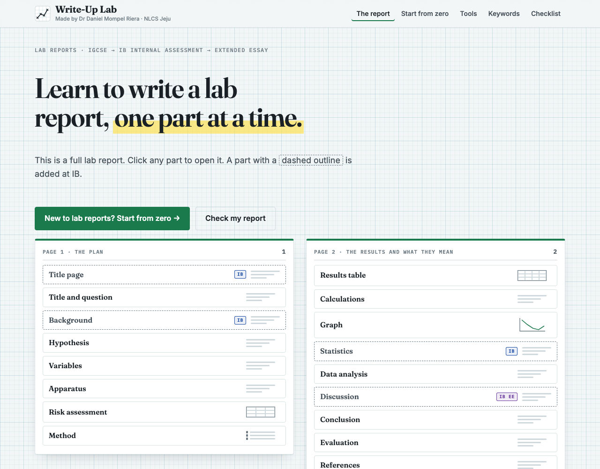

# Write-Up Lab

**Learn to write up an experiment, one part at a time** — from a Cambridge IGCSE Biology lab report to the
IB Internal Assessment and the IB Extended Essay.

Made by **Dr Daniel Mompel Riera**, NLCS Jeju.

## What a student can do

- **Explore a complete report.** The front page is one lab report (amylase and temperature), laid out as
  two pages of parts. Click a part and it opens in place: the example, what it does, where marks are lost,
  and buttons that show how the IB Internal Assessment and the Extended Essay change it. Parts that exist
  only at IB sit on the same pages with a dashed outline.
- **Learn each part.** Every part has its own page in tabs: Learn (short steps you open one at a time,
  with the IB steps marked) · Red pen on a weak example · Mistakes to avoid · Test yourself · Keywords.
  A "Compare" bar shows how the part changes from IGCSE to the IA and the EE.
- **Practise on tools**: build a table, plot points on graph paper, find the faults in a graph, see error bars
  change as the data change, choose a statistical test, build a research question, a risk assessment and a
  reference.
- **Start from zero** — a route through the parts in order, for a student who has forgotten everything.
- **Check my report** — the checklist for their level, ticked against their own report.

Progress and ticks stay on the student's device. Nothing is sent anywhere.

## Checked against

The IB Biology guide (first assessment 2025), the IB Extended Essay guide (first assessment 2027), the IB
Sciences experimentation guidelines (2023) and the Cambridge IGCSE Biology 0610 syllabus (2026–2028) with its
mark schemes and examiner reports. Where something is good practice rather than an exam requirement, the page
says so.

<b>Behind the scenes</b>

- Static files, no build step to run the site. Open `index.html` through any web server.
- The content of each part is one file in `js/stations/`; each tool is one file in `js/widgets/`.
  `SPEC.md` is the rule book for writing either.
- `node tools/check.mjs` checks every part before anything is published: every question has a right answer,
  every highlighted keyword has a meaning, every red-pen mark has an explanation, model answers are written
  impersonally, and the example data are recomputed. `node tools/check.mjs --stamp` also refreshes the
  version stamps.
- `node tools/smoke.mjs` opens every part at every level in a headless browser and reports any error.
- The answers to the self-tests are in the page. This site teaches; it does not grade.

## Licence

Code: AGPL-3.0 (`LICENSE`). Teaching material: CC BY-NC-SA 4.0 (`LICENSE-CONTENT`). See `NOTICE`.
